# curso_flutter

A new Flutter project.

## Getting Started

This project is a starting point for a Flutter application.

A few resources to get you started if this is your first Flutter project:

- [Lab: Write your first Flutter app](https://docs.flutter.dev/get-started/codelab)
- [Cookbook: Useful Flutter samples](https://docs.flutter.dev/cookbook)

For help getting started with Flutter development, view the
[online documentation](https://docs.flutter.dev/), which offers tutorials,
samples, guidance on mobile development, and a full API reference.

# Taller 1 - Flutter

## 🎯 Objetivo
Construir una pantalla básica en Flutter con `StatefulWidget` y evidenciar el uso de `setState()`.

## 👩‍🎓 Estudiante
- Nombre: Daniela Erazo Marín
- Código: 230221027

## 🚀 Pasos para ejecutar
1. Clonar el repositorio:
   ```bash
   git clone https://github.com/daniela-erazo-marin/curso_flutter.git

2. Ingrese al directorio del proyecto:

   cd curso-flutter


3. Instalar las dependencias:

   flutter pub get


4. Ejecuta el proyecto en un emulador o dispositivo físico:

   flutter run

## Versión de flutter: Flutter 3.35.2


## Proyecto en uso:


# Taller 2 - Flutter Navegación y Widgets

## 📌 Rutas
- `/` → HomeScreen
- `/paso_parametros` → Paso de parámetros con go/push/replace
- `/detalle/:parametro/:metodo` → Muestra parámetros recibidos
- `/ciclo_vida` → Demostración del ciclo de vida de un StatefulWidget
- `/widgets_demo` → Demostración de GridView, TabBar y ExpansionTile
- `/home/:parametro/:metodo` Muestra parámetros recibidos desde home page


## 📌 Widgets usados
- **GridView** → Mostrar lista de elementos en cuadrícula.
- **TabBar** → Manejo de secciones/pestañas en una misma pantalla.
- **ExpansionTile** → Mostrar información expandible (tercer widget).
- **Drawer personalizado** → Navegación lateral común.
- **Scaffold + AppBar** → Estructura base de todas las vistas.

## 📌 Ciclo de vida evidenciado
Se registran en consola:
- `initState()` → Inicialización del widget.
- `didChangeDependencies()` → Cuando cambian dependencias (ej. tema).
- `build()` → Cada vez que se reconstruye la UI.
- `setState()` → Cuando se actualiza el estado.
- `dispose()` → Antes de destruir el widget.


# Taller 3 - Asincronía, Timer e Isolates en Flutter

## 🧠 1. Uso de Future / async / await
- **Cuándo usarlo:**  
  Cuando queremos realizar operaciones asincrónicas sin bloquear la interfaz de usuario (UI).  
  Ejemplo: cargar datos desde una API o base de datos.

- **Implementación:**  
  Se usó `Future.delayed` para simular una carga de datos (2–5 s) y `async/await` para esperar el resultado.
  Se muestran estados en pantalla:
  - “Cargando...” → `CircularProgressIndicator`
  - “Éxito” → muestra la lista de nombres
  - “Error” → mensaje de error en caso de excepción

---

## ⏱️ 2. Uso de Timer
- **Cuándo usarlo:**  
  Para tareas repetitivas o temporizadas, como un cronómetro, cuenta regresiva o refresco de datos periódicos.

- **Implementación:**  
  Se usó `Timer.periodic` que se ejecuta cada segundo.  
  Botones disponibles:
  - Iniciar
  - Pausar
  - Reanudar
  - Reiniciar  
  Además, se limpia el recurso con `_timer.cancel()` en `dispose()`.

---

## ⚙️ 3. Uso de Isolate
- **Cuándo usarlo:**  
  Para tareas pesadas de CPU (procesamiento intensivo, cálculos grandes, generación de datos)  
  que no deben bloquear la UI principal.

- **Implementación:**  
  Se usa `Isolate.spawn()` y `ReceivePort` para comunicarse entre hilos.  
  El isolate ejecuta una suma grande y devuelve el resultado a la interfaz.

---

## 🗂️ 4. Diagrama de flujo de pantallas


[Menu Principal]
│
├──► [FutureView] → Simula carga de datos
│
├──► [TimerView] → Cronómetro con botones
│
└──► [IsolateView] → Tarea pesada en hilo secundario

El flujo de la app se encuentra en el word entregado.


# Taller HTTP con Flutter – Recetas con TheMealDB

## 📖 Descripción de la API usada

Este proyecto consume la API pública **TheMealDB**, que permite buscar recetas y obtener detalles de las mismas.

- **Variable de entorno usada**:  
  `MEAL_API_URL = https://www.themealdb.com/api/json/v1/1`

- **Endpoint de búsqueda**  
  `GET https://www.themealdb.com/api/json/v1/1/search.php?s={nombre}`  
  Si por ejemplo buscas *Arrabiata*:

  **Ejemplo de respuesta JSON**:
```json
{
  "meals": [
    {
      "idMeal": "52771",
      "strMeal": "Spicy Arrabiata Penne",
      "strCategory": "Vegetarian",
      "strArea": "Italian",
      "strInstructions": "Bring a large pot …",
      "strMealThumb": "https://www.themealdb.com/images/media/meals/ustsqw1468250014.jpg",
      "strTags": "Pasta,Curry",
      "strIngredient1": "penne rigate",
      "strMeasure1": "1 pound",
      "strIngredient2": "olive oil",
      "strMeasure2": "1/4 cup"
      // … hasta strIngredient20 / strMeasure20 …
    }
  ]
}
```


Endpoint de detalle por ID
GET https://www.themealdb.com/api/json/v1/1/lookup.php?i={id}
Devuelve un objeto meals con una sola receta con todos sus datos.


Estructura de carpetas principal usada:

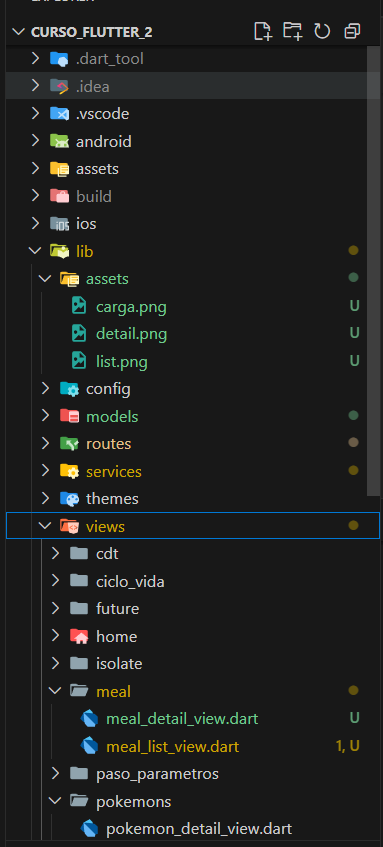


lib/
  models/
    meal.dart
  services/
    meal_service.dart
  views/
    home/
    ciclo_vida/
    paso_parametros/
    widgets_demo/
    meal/
      meal_list_view.dart
      meal_detail_view.dart
  routes/
    app_router.dart
  themes/
    app_theme.dart
  widgets/
    base_view.dart
    custom_drawer.dart
main.dart
.env

Especificaciones:

models/meal.dart — modelo Dart que mapea JSON a objeto Meal.

services/meal_service.dart — lógica HTTP para consumir los endpoints y lanzar errores si algo falla.

views/meal/ — pantallas de listado (meal_list_view.dart) y detalle (meal_detail_view.dart).

routes/app_router.dart — configuración de rutas con go_router.

themes/, widgets/ y otras vistas pertenecientes a otros módulos de la app.


Estas son las rutas principales del módulo de recetas junto con los parámetros:

/meal	– MealListView (listado de recetas)
/meal/:id - meal_detail_view	id vía pathParameter (Detalle de recetas)


### Lista de Elementos 

📸 Listado de recetas con imágenes y nombres

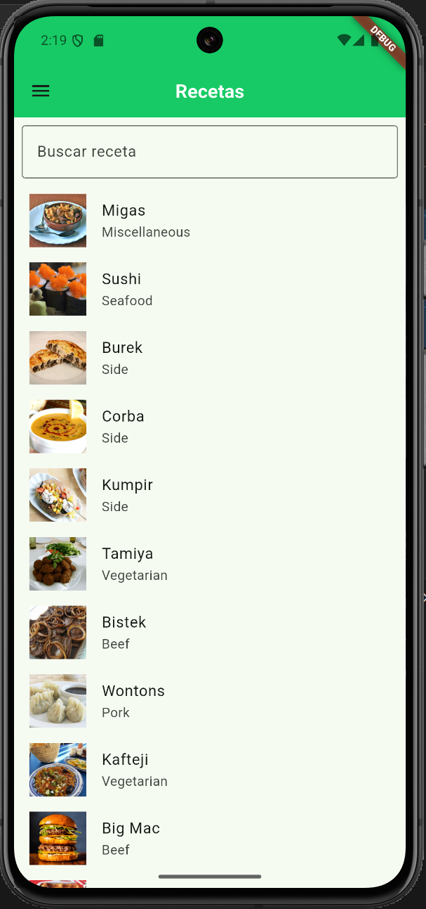

 Detalle de receta mostrando instrucciones, ingredientes y tags

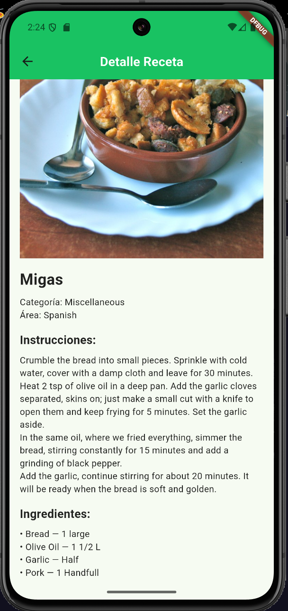

📸 Pantalla de carga (CircularProgressIndicator)

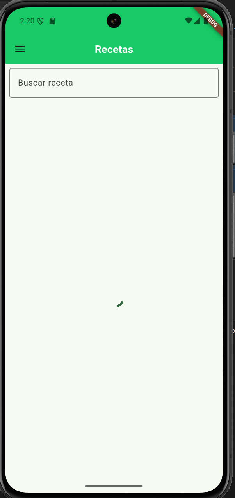

📸 Mensaje de error si falla la petición

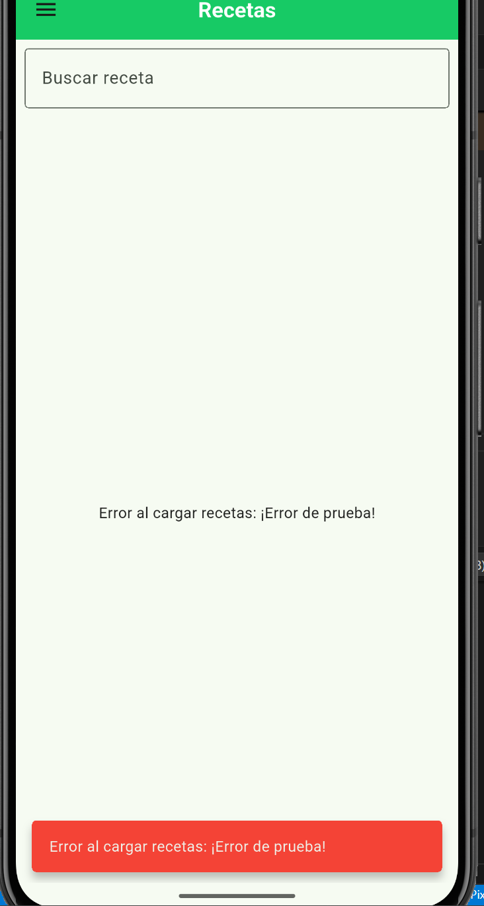

📸 Mensaje de éxito

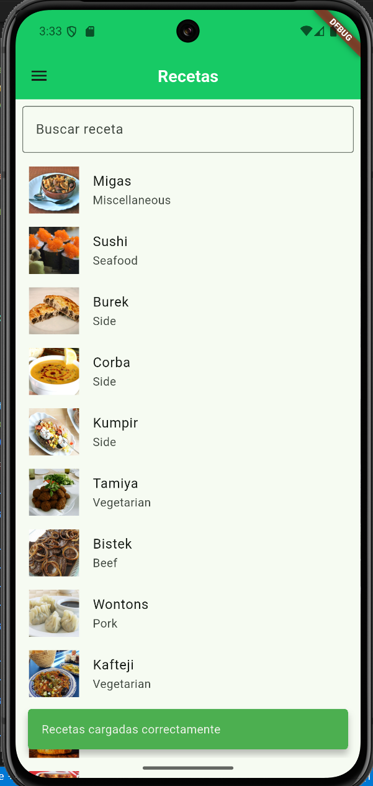


# Proyecto – Distribución de APK de prueba

## Flujo general  
Generar APK → App Distribution → Testers → Instalación → Actualización  
En este proyecto de la asignatura, seguimos ese flujo para entregar un build de prueba y luego su actualización.

## Publicación  
### Pasos resumidos  
1. En el proyecto Flutter actualiza el campo de versión en `pubspec.yaml`, por ejemplo:  
   ```yaml
   version: 1.0.1+2

donde 1.0.1 es el versionName y 2 el versionCode.

2. Construir el APK de release con el comando (flutter build apk).

3. En la consola de Firebase: ir al proyecto correspondiente → App Distribution → “Releases”.

Subir el APK generado, añadir el archivo google-services.json si corresponde (en la primera version 1.0.0 se requiere google-services.json firebase da el paso a paso para hacerlo en la primera version), y asignar el build al grupo de testers ( QA_Clase o verificadores Uceva).

Ingresar las Release Notes (qué cambió, versión, instrucciones de testers).

En “Testers & Groups” verifica que el correo dduran@uceva.edu.co está agregado.

Distribuir: el tester recibe correo, instala la app en un dispositivo Android físico y verifica la ejecución.

Para actualización: incrementa versión+code, vuelve a construir, subir nuevo build, repetir distribución.


Versionado

Se uso el formato: version: A.B.C+X en pubspec.yaml.

Donde A.B.C es la versión visible al usuario.

X es el build number/ versionCode para Android, debe incrementarse siempre que se publica un nuevo build.

Ejemplo usado en esta entrega: 1.0.1+2.

Formato de Release Notes usado

Versión: [versión] (versionCode: [code])

Fecha de lanzamiento: [YYYY-MM-DD]

Responsable: [nombre Responsable / equipo]

Qué hay de nuevo: lista de nuevas funcionalidades o mejoras.

Correcciones (Fixes): lista de errores resueltos.

Notas para testers / instrucciones de instalación: cómo instalar, qué revisar, grupo de testers.

Limitaciones conocidas / próximos pasos: aspectos no implementados o pendientes para futuras versiones.


Evidencias: 


Se incluyen capturas en el documento de pantalla del panel de Firebase (Releases y Testers), del correo de invitación, y de la app instalada en el dispositivo Android. 

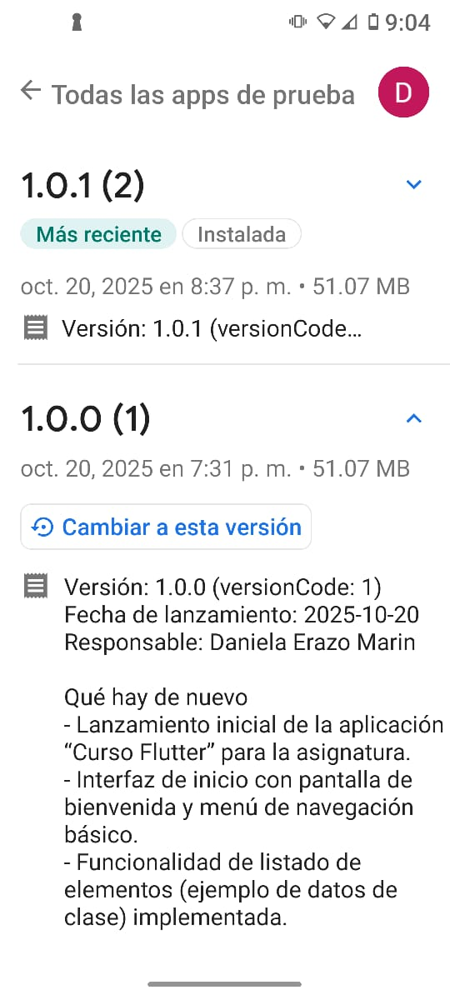

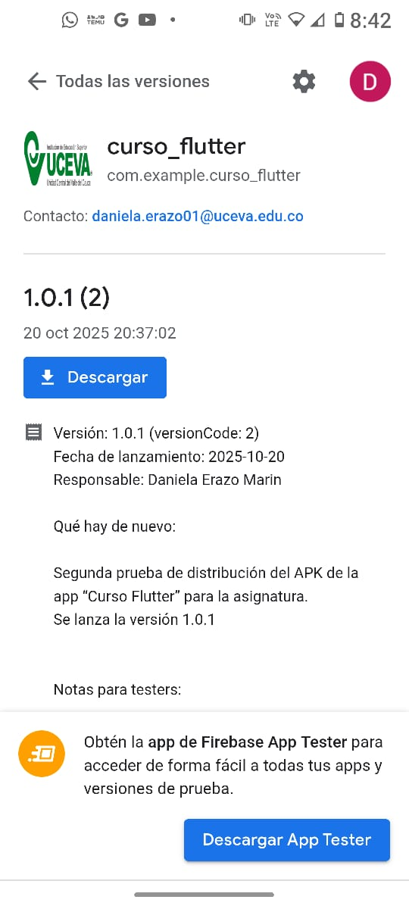


# Taller – Autenticación con API Pública VisionTic

## 1. Autenticación – Clase AuthService (lib/services/auth_service.dart)

Endpoint utilizado:

POST https://parking.visiontic.com.co/api/login


### Descripción técnica:

Se envían las credenciales (email, password) en formato JSON al endpoint.

La respuesta incluye un token JWT, tipo de token (type) y tiempo de expiración (expires_in).

La clase AuthService maneja todo el proceso de autenticación, almacenamiento y recuperación de credenciales.


### Flujo del método login():

Envía la solicitud al endpoint /api/login.

Si la autenticación es exitosa:

Guarda el token y sus metadatos en FlutterSecureStorage:

await _secureStorage.write(key: 'token', value: data['token']);
await _secureStorage.write(key: 'token_type', value: data['type']);
await _secureStorage.write(key: 'expires_in', value: data['expires_in'].toString());


### Almacena los datos no sensibles del usuario en SharedPreferences:

await prefs.setString('user_name', data['user']['name']);
await prefs.setString('user_email', data['user']['email']);
await prefs.setInt('user_id', data['user']['id']);


Devuelve un mapa con el resultado (success: true/false).


## 2. Almacenamiento Local

Dato: Sensible	
Herramienta: FlutterSecureStorage	
Clave: token, token_type, expires_in	
Descripción: Almacenamiento cifrado en Keystore (Android) o Keychain (iOS). Ideal para credenciales y tokens.


Dato: No sensible	
Herramienta: SharedPreferences
Clave: user_name, user_email, user_id	
Descripción: Almacenamiento en texto plano, útil para configuraciones o datos visibles.


Métodos relacionados:

getToken() → Recupera el token JWT almacenado.

getUser() → Carga los datos del usuario guardados en preferencias.

logout() → Elimina toda la información del almacenamiento local.


## 3. Vista Principal – Clase HomeScreem (lib/views/home/home_screem.dart)


Esta pantalla actúa como panel de evidencia, mostrando los datos almacenados de la sesión actual.

Componentes principales:

Obtiene datos del usuario (SharedPreferences) y token (SecureStorage) en _loadData().

Muestra tarjetas con:

Nombre, correo e ID del usuario.

Token JWT, tipo de token y tiempo de expiración.

Incluye botones en el AppBar:

🔄 Refrescar datos (_loadData()).

🚪 Cerrar sesión (_logout()).

### Estado del token:
Se indica visualmente si el token está presente o no (token cargado correctamente o ausente).


## 4. Cierre de Sesión – Método logout() (AuthService + HomeScreem)

### Proceso técnico:

Desde HomeScreem, el método _logout() solicita confirmación mediante un AlertDialog.

### Si el usuario confirma:

Se ejecuta AuthService.logout() para eliminar:

Datos sensibles (FlutterSecureStorage): token, token_type, expires_in.

Datos no sensibles (SharedPreferences): user_id, user_name, user_email.

### Muestra un mensaje de éxito con SnackBar:

✅ Sesión cerrada exitosamente

Redirige al login usando GoRouter:

context.go('/login');

## 🧩 5. Clases Principales del Proyecto

AuthService	lib/services/auth_service.dart	Maneja autenticación, tokens y almacenamiento.

HomeScreem	lib/views/home/home_screem.dart	Muestra evidencia de sesión y controla el logout.

BaseView	lib/widgets/base_view.dart	Estructura base con CustomDrawer para navegación.

CustomDrawer	lib/widgets/custom_drawer.dart	Menú lateral persistente para acceder a las vistas.


📸 Error en autenticación 
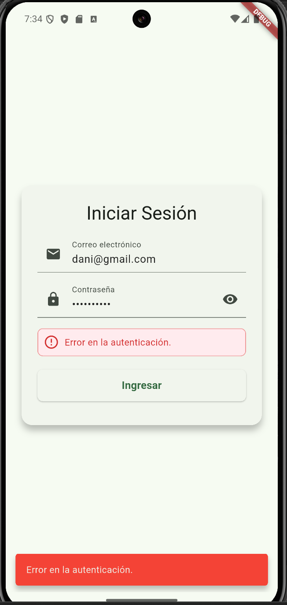

📸 Sesión cerra con éxito
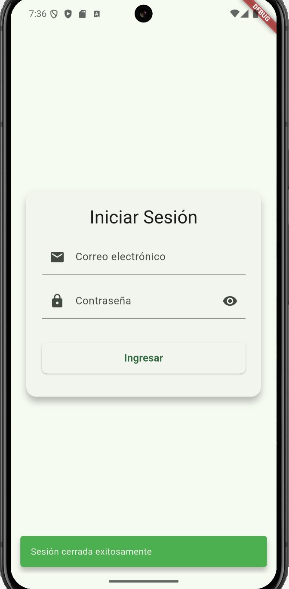

📸 Home page
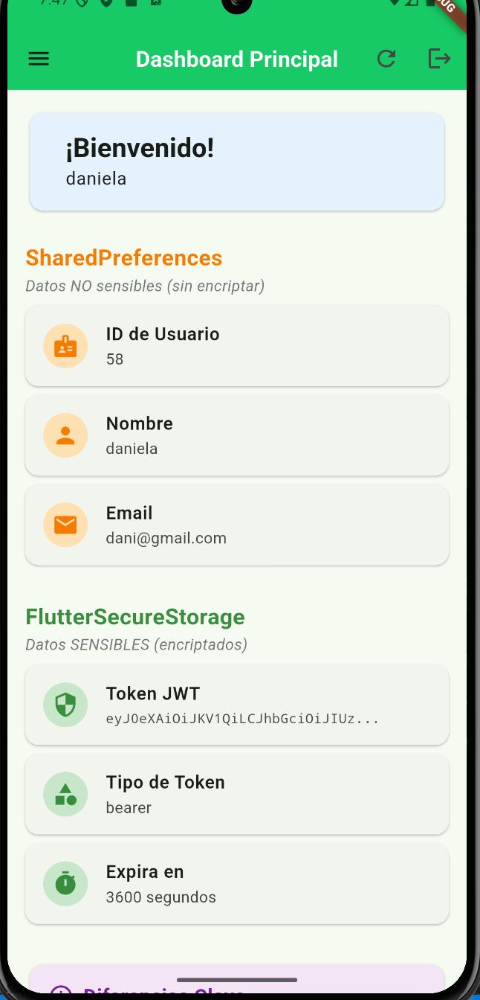


# Descripción técnica del Taller3: Integración con Firebase

Durante el desarrollo del taller se construyó una aplicación en Flutter orientada a la gestión de universidades, implementando una arquitectura modular basada en la separación por capas: modelo, servicios e interfaces gráficas.

## 1.	Modelo de datos (Entidad Universidad)
Se diseñó la clase Universidad como modelo base, la cual contiene los atributos principales:
•	nit (string)
•	nombre (string)
•	direccion (string)
•	telefono (string)
•	pagina_web (string, URL)
Esta estructura fue implementada en Dart y métodos fromMap() y toMap() para permitir su integración con Firebase.

## 2.	Servicio de datos (UniversidadService)
Se creó un servicio encargado de la comunicación con la base de datos cloud Firebase, gestionando las operaciones CRUD:
o	getUniversidades() → obtiene la lista de universidades.
o	addUniversidad() → agrega un nuevo registro.
o	updateUniversidad() → actualiza los datos existentes.
o	deleteUniversidad() → elimina un registro.
El servicio utiliza la librería cloud_firestore para manejar la persistencia en la nube de manera asíncrona, garantizando integridad y respuesta en tiempo real.

## 3.	Configuración de Firebase
El proyecto se integró con Firebase mediante la consola de desarrollador, registrando la aplicación y descargando los archivos de configuración firebase_options.dart y firebase.json.
Se habilitó Firestore Database en modo de prueba y se crearon las colecciones necesarias (universidades).
La estructura de cada documento contiene los campos mencionados en el modelo, con sus tipos de datos definidos (String).

## 4.	Interfaz gráfica (UI)
Se desarrolló una interfaz visual responsiva utilizando componentes de Material Design:
o	Formulario de registro con TextFormField y validadores personalizados (por ejemplo, validación de formato para correos y URLs).
o	Listado tipo grid implementado con GridView y _buildGridContent(), mostrando los datos de cada universidad con un diseño limpio, botones de acción (IconButton) y manejo de eventos (onPressed, showDialog, etc.).
o	Uso de ColorScheme para adaptar los colores a los temas claro/oscuro del sistema.

## 5.	Validaciones técnicas
Se implementaron validaciones en los campos del formulario para garantizar la integridad de los datos:
o	El nombre y dirección no pueden estar vacíos.
o	La página web se valida usando Uri.tryParse() para asegurar un formato correcto de URL.

## 6.	Pruebas con datos ficticios
Finalmente, se cargaron registros de prueba en la colección de Firebase con información simulada de universidades colombianas (nit, nombre, dirección, teléfono y página web) para verificar el correcto funcionamiento del flujo completo de registro, lectura, actualización y eliminación.

📸 Doc


📸 Instalar Flutter Fire CLI


